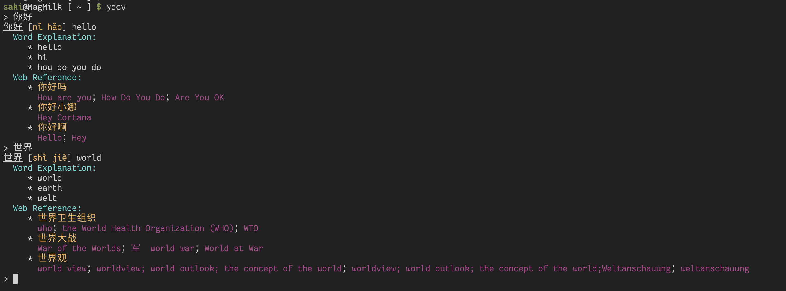

# ydcv-saki

ydcv-saki 是一款有道词典命令行客户端，由 Farseerfc 老师的 [ydcv-rs](https://github.com/farseerfc/ydcv-rs) fork 而来，并做了一些符合个人风格口味的修改。



## 区别

与原版相比，主要区别如下：

- 删除了用不到的可使用有道词典 JSON API 执行查询请求的功能。
- 支持 Wayland 下剪切板单词查询（`-x` / `--selection`）
- 支持命令行补全生成 (`-g`/`--gneneral-completion`)
- 支持保存查询历史，再次打开该应用会加载已保存的历史查询。

## 编译

确保已经安装了 Rust 1.85+ 和 GCC/Clang，执行：

```bash
cargo build --release
```

编译完成后，输入以下命令即可运行：

```bash
./target/release/ydcv
```
